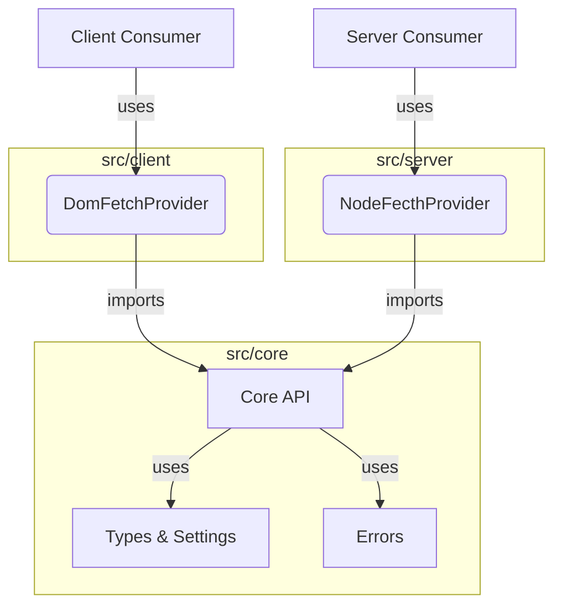

- **Client Consumer**: Web or frontend app using the client API provider.
- **Server Consumer**: Node.js or backend app using the server API provider.
- **Core API**: Main logic shared by both client and server.
- **Types & Settings**: Type definitions and configuration logic.
- **Errors**: Centralized error handling.

> This is an inferred structure. For more accuracy, please specify any unique architectural choices or share code from `src/core/apiCore.ts` or `src/index.ts`.

---

**You can view your full source structure here:**  
[monzter50/boilerplate-api-core-library/src/](https://github.com/monzter50/boilerplate-api-core-library/tree/main/src/)

Would you like a more detailed diagram with data flow, dependencies, or an explanation of key modules? If so, please specify which files or logic you want to focus on!